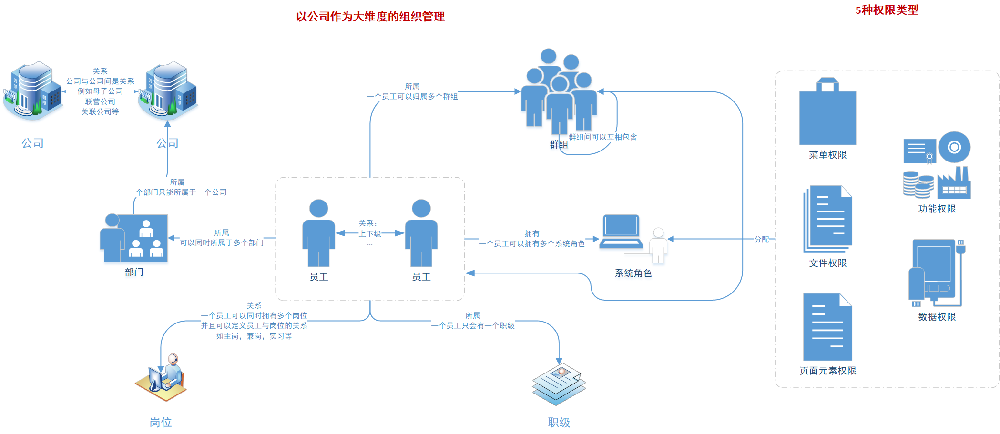

# sparrow-platform

每个做开发的人，都绕不开组织和权限这两个最基本的功能。因此一个良好的组织权限管理平台，对于一个系统来讲很重要。本文基于多年的开发经验，参考了RBAC和ABAC的设计思想来实现一整套的框架。

首先我们来看看组织和权限的业务整体架构：

可以看到，整个架构分两大部分：组织管理和权限管理。组织管理包含：
公司、部门、员工、岗位、职级、系统角色，群组的基本管理；权限管理则包含菜单、文件、页面元素、功能、数据等的权限管理。这几项基本囊括了一个系统最基本的基础要素，也基本能满足绝大部分的信息系统的要求。

公司：公司是一个法人机构，或一个独立的对外的组织。一个公司的建立及撤销一般认为变动较大，影响面比较广。这也是和部门不一样的地方。公司与公司之间则存在着关系，例如战略投资关系，全资子公司等等。

部门：部门则为公司或机构中的一个组织单元，可由公司内部自行决定而设立，对外尽管有些展现，但外部更关注在公司名称和人的岗位，因此部门为归属与公司，且自由度较大，部门的设立及撤销也相对简便。部门与部门，或部门与公司间只有归属的关系，不会存在其他的关系。

岗位：岗位为公司内部或外部的工作的职责的体现。一般来说每个员工都可以兼职多个岗位，员工与岗位之间是一种关系，并非简单的包含。这样设计的原因是可以更细粒度的做一些控制。

职级：一个人在一个公司里，只会有一个级别，因为这个级别属于发薪级别，代表员工在公司的最高地位。

群组：为临时或某些特定事情而组织起来的一群人。一般用来做通知或者权限控制。

系统角色：是用来将一组系统权限组合起来，方便权限的管理。为什么不直接用群组而将系统角色单独分开呢？因为群组更多的重点在一群人，关注点在人；而系统角色的关注点在系统功能和权限。

菜单权限：菜单权限为一个组织菜单树的权限，代表个账号对菜单的显示或隐藏。

文件权限：可以对某个文件进行查看、编辑、删除、下载等的控制。

页面元素：可以对页面上的控件进行显示、隐藏、编辑进行权限控制。

功能权限：对系统的功能授予是否可执行的权限，例如新增、编辑删除等功能。

数据权限：数据权限分两部分，一个是model权限，即整个实体的权限控制，例如是否可以读取某篇文章，或者是否可以编辑某篇文章或删除。另外一个是字段权限，即某个属性的读取、编辑、删除权限控制（可参考ABAC权限控制https://en.wikipedia.org/wiki/Attribute-based_access_control）本文基于ABAC来设计数据和字段权限。

到此，业务功能层面已经完全介绍完毕，下面我们来看看表结构。
先看看组织管理部分（表的设计为最基础部分，大家可以自行扩充字段信息）：

一共11张表，完整的对应前面的组织管理部分。

我们再来看看权限管理部分：

一共18张表，对应于前面介绍的权限管理部分。大家可以根据表明对应其所实现的功能，就不在本文中详细介绍了。下一篇则和大家分析一下如何进行系统开发，并和大家一起分析一下源码。

实现的技术为springboot+mysql，前端使用angular技术。为什么使用angular，因为angular非常适合单页面的开发，而且angular很适合进行大型的信息系统开发，相比较于react和vue，他是一个框架，所有工具都可开箱即用，而且有很多解决方案，省去了开发人员的寻找成本。当然在学习曲线上非常陡峭，入门较难，但只要坚持下去，后面就舒服了。

如果大家想一起讨论和交流，欢迎加本人微信，请注明（组织权限模型）：
